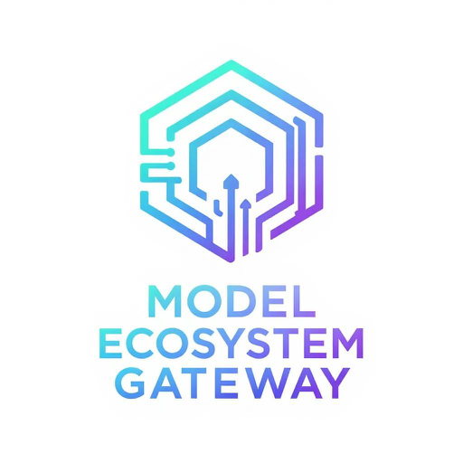
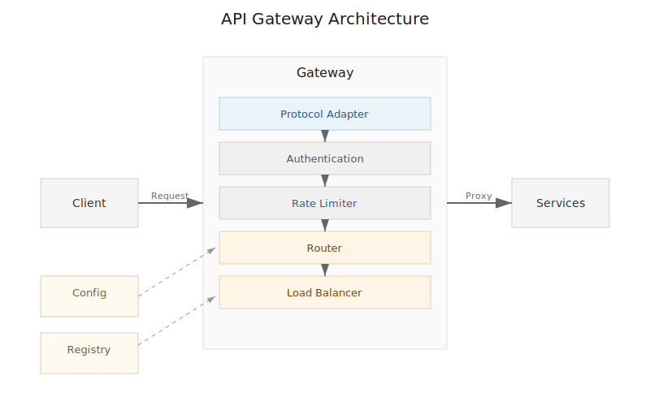
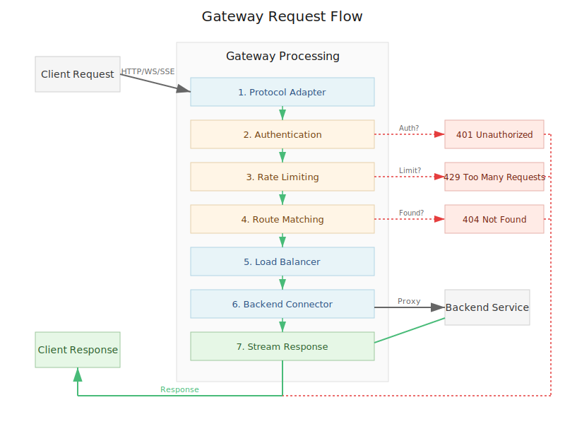

# Gateway

<p align="center">
  <picture>
    <source media="(prefers-color-scheme: dark)" srcset="assets/images/logo-dark.png">
    <source media="(prefers-color-scheme: light)" srcset="assets/images/logo-light.png">
    
  </picture>
</p>

<p align="center">
  A high-performance, multi-protocol API gateway written in Go with clean architecture, supporting HTTP/WebSocket/SSE/gRPC protocols, authentication, rate limiting, and service discovery.
</p>

## Quick Start

```bash
# Install
go install github.com/model-ecosystem/gateway@latest

# Run with zero config
gateway

# Test it works
curl http://localhost:8080/_gateway/health

# Proxy to a backend
echo 'gateway:
  router:
    rules:
      - path: /*
        serviceName: httpbin
  registry:
    static:
      services:
        - name: httpbin
          instances:
            - address: httpbin.org
              port: 443' > gateway.yaml
              
gateway -config gateway.yaml
curl http://localhost:8080/get
```

## Features

### Core Features
- **HTTP Gateway**: High-performance reverse proxy with streaming responses
- **Load Balancing**: Round-robin with health checking
- **Static Service Discovery**: Configuration-based service registry
- **Structured Error Handling**: Type-safe errors with proper HTTP status mapping
- **Per-Route Configuration**: Timeouts, load balancing strategies
- **Clean Architecture**: Layered design with clear separation of concerns

### Protocol Support
- **Multi-Protocol Frontend**: HTTP/HTTPS, WebSocket, Server-Sent Events (SSE)
- **Multi-Protocol Backend**: HTTP, WebSocket, SSE, gRPC
- **Protocol Conversion**: HTTP to gRPC transcoding (basic)
- **Stateful Connections**: WebSocket and SSE with connection management
- **TLS/mTLS**: Full encryption support for frontend and backend

### Security & Authentication
- **JWT Authentication**: RS256/HS256, JWKS endpoint support
- **API Key Authentication**: SHA256 hashing, flexible extraction
- **Rate Limiting**: Token bucket algorithm, per-route configuration
- **CORS Support**: Configurable cross-origin resource sharing

### Service Discovery
- **Static Configuration**: YAML-based service definitions
- **Docker Discovery**: Automatic discovery via container labels
- **Health Checking**: Active and passive health monitoring

### Resilience & Reliability
- **Circuit Breaker**: Prevent cascading failures
- **Request Retry**: Configurable retry with exponential backoff
- **Advanced Load Balancing**: Weighted, least-connections, response-time based
- **Retry Budget**: Prevent retry storms

### Observability
- **OpenTelemetry Integration**: Distributed tracing and metrics
- **Prometheus Metrics**: Request rates, latencies, error rates
- **Structured Logging**: JSON logs with trace correlation
- **Health Endpoints**: Built-in gateway health status

## Quick Start

```bash
# Build the gateway
make build

# Build and run
make run

# Run without building
make dev

# Run tests
make test

# Clean build artifacts
make clean
```

## Configuration

Configuration is stored in YAML files. Basic example (`configs/base/gateway.yaml`):

```yaml
gateway:
  frontend:
    http:
      host: "0.0.0.0"
      port: 8080
      readTimeout: 30
      writeTimeout: 30

  registry:
    type: static
    static:
      services:
        - name: example-service
          instances:
            - id: example-1
              address: "127.0.0.1"
              port: 3000
              health: healthy

  router:
    rules:
      - id: example-route
        path: /api/example/*
        serviceName: example-service
        loadBalance: round_robin
        timeout: 10  # Per-route timeout in seconds
```

## Architecture

The gateway follows a clean three-layer architecture with idiomatic Go patterns.

### Core Architecture

<picture>
  <source media="(prefers-color-scheme: dark)" srcset="assets/images/architecture/gateway-overview-dark.svg">
  <source media="(prefers-color-scheme: light)" srcset="assets/images/architecture/gateway-overview.svg">
  
</picture>

The gateway implements a layered architecture with clear separation between data flow and control plane:

- **Data Flow Path**: Client → Protocol Adapter → Auth → Rate Limiter → Router → Load Balancer → Backend Connector → Services
- **Control Plane**: Configuration Manager and Service Registry configure the data plane components
- **Protocol Support**: HTTP/HTTPS, WebSocket, SSE ingress; HTTP, gRPC, WebSocket, SSE egress

For detailed architecture documentation, see [Architecture Guide](docs/architecture/README.md).

### Request Flow

<picture>
  <source media="(prefers-color-scheme: dark)" srcset="assets/images/architecture/request-flow-dark.svg">
  <source media="(prefers-color-scheme: light)" srcset="assets/images/architecture/request-flow.svg">
  
</picture>

### Key Design Principles

- **Interface-Driven**: Small, focused interfaces for extensibility
- **Function Types**: Handlers and middleware as function types
- **Streaming First**: No buffering, direct streaming from backend to client
- **Error as Values**: Structured errors with context and proper HTTP mapping
- **Standard Library**: Minimal dependencies, built on net/http
- **Graceful Degradation**: Fallback mechanisms for service failures


## Error Handling

The gateway uses structured errors that automatically map to HTTP status codes:

| Error Type | HTTP Status | Description |
|------------|-------------|-------------|
| `ErrorTypeNotFound` | 404 | Route or service not found |
| `ErrorTypeUnavailable` | 503 | No healthy backend instances |
| `ErrorTypeTimeout` | 408 | Request timeout exceeded |
| `ErrorTypeBadRequest` | 400 | Invalid request format |
| `ErrorTypeUnauthorized` | 401 | Authentication required |
| `ErrorTypeForbidden` | 403 | Insufficient permissions |
| `ErrorTypeRateLimit` | 429 | Rate limit exceeded |
| `ErrorTypeInternal` | 500 | Internal server error |

All errors include contextual information for debugging and are properly logged with trace IDs.

## Testing

```bash
# Run all tests
./scripts/test/run-tests.sh

# Run specific test suites
go test ./internal/...
go test ./test/integration/...

# Run with coverage
go test -cover ./...

# Run benchmarks
go test -bench=. ./internal/router/...
```

### Test Environment

```bash
# Start test environment with mock servers
cd test/mock
docker-compose up

# Run integration tests against test environment
go test ./test/integration/...
```

## Requirements

- Go 1.24 or later
- Make (for build commands)

## Dependencies

- `gopkg.in/yaml.v3` - YAML configuration parsing
- `github.com/gorilla/websocket` - WebSocket support
- `github.com/docker/docker` - Docker service discovery
- `github.com/golang-jwt/jwt/v5` - JWT authentication
- `github.com/prometheus/client_golang` - Prometheus metrics
- `github.com/redis/go-redis/v9` - Redis support for rate limiting
- `go.opentelemetry.io/otel` - OpenTelemetry integration
- `google.golang.org/grpc` - gRPC support
- `k8s.io/client-go` - Kubernetes service discovery
- `github.com/fsnotify/fsnotify` - File watching for hot reload
- Standard library for core functionality

## Documentation

Comprehensive documentation is available in the `/docs` directory:

### Guides
- **[Getting Started](docs/guides/getting-started.md)** - Quick setup and basic usage
- **[Configuration Guide](docs/guides/configuration.md)** - Complete configuration reference
- **[Authentication](docs/guides/authentication.md)** - JWT and API key setup
- **[Rate Limiting](docs/guides/rate-limiting.md)** - Request rate limiting
- **[TLS Setup](docs/guides/tls-setup.md)** - TLS/mTLS configuration
- **[gRPC Support](docs/guides/grpc.md)** - gRPC backends and transcoding
- **[Metrics & Monitoring](docs/guides/metrics.md)** - Observability features
- **[Resilience Patterns](docs/guides/resilience.md)** - Circuit breakers and retries

### Architecture
- **[Architecture Overview](docs/architecture/overview.md)** - System design and components
- **[Documentation Index](docs/README.md)** - Complete documentation navigation

## Configuration Examples

See working configuration examples in:
- `/configs/base/gateway.yaml` - Basic HTTP routing configuration
- `/configs/examples/`:
  - `auth.yaml` - JWT and API Key authentication
  - `tls.yaml` - TLS/mTLS setup
  - `websocket.yaml` - WebSocket configuration
  - `sse.yaml` - Server-Sent Events
  - `grpc.yaml` - gRPC backend and transcoding
  - `docker.yaml` - Docker service discovery
  - `session-affinity.yaml` - Sticky sessions
  - `ratelimit.yaml` - Rate limiting
  - `circuit-breaker.yaml` - Circuit breaker patterns
  - `retry.yaml` - Retry configuration
  - `telemetry.yaml` - OpenTelemetry setup

## License

This project is released under the [MIT License](LICENSE).
