# Request Flow and Sequence Diagrams

This document illustrates how different types of requests flow through the gateway with detailed sequence diagrams.

## 📋 Table of Contents

1. [HTTP Request Flow](#http-request-flow)
2. [Authenticated Request Flow](#authenticated-request-flow)
3. [WebSocket Connection Flow](#websocket-connection-flow)
4. [SSE Stream Flow](#sse-stream-flow)
5. [Rate Limited Request Flow](#rate-limited-request-flow)
6. [Service Discovery Flow](#service-discovery-flow)
7. [Error Handling Flow](#error-handling-flow)

## HTTP Request Flow

Basic HTTP request processing through the gateway:

```mermaid
sequenceDiagram
    participant Client
    participant HTTPAdapter as HTTP Adapter
    participant Middleware as Middleware Chain
    participant Router
    participant Registry as Service Registry
    participant LB as Load Balancer
    participant HTTPConnector as HTTP Connector
    participant Backend as Backend Service

    Client->>HTTPAdapter: HTTP Request
    Note over HTTPAdapter: TLS termination<br/>Parse HTTP request
    
    HTTPAdapter->>HTTPAdapter: Convert to core.Request
    HTTPAdapter->>Middleware: Handle(ctx, request)
    
    Note over Middleware: Recovery → Logging → Auth → RateLimit
    
    Middleware->>Router: Route(request)
    Router->>Router: Match path pattern
    Router->>Registry: GetService(serviceName)
    Registry-->>Router: Service instances
    
    Router->>LB: SelectInstance(instances)
    LB-->>Router: Selected instance
    
    Router->>HTTPConnector: Forward(request, instance)
    HTTPConnector->>HTTPConnector: Get connection from pool
    HTTPConnector->>Backend: HTTP Request
    Backend-->>HTTPConnector: HTTP Response
    
    HTTPConnector-->>Router: core.Response
    Router-->>Middleware: core.Response
    Middleware-->>HTTPAdapter: core.Response
    
    HTTPAdapter->>HTTPAdapter: Convert to HTTP response
    HTTPAdapter-->>Client: HTTP Response
```



### Key Steps Explained

1. **TLS Termination**: The HTTP adapter handles TLS, converting HTTPS to internal HTTP
2. **Request Conversion**: HTTP-specific details are abstracted into `core.Request`
3. **Middleware Pipeline**: Each middleware can modify the request or short-circuit
4. **Route Matching**: The router uses pattern matching (e.g., `/api/*`) to find routes
5. **Service Discovery**: The registry provides healthy instances for the service
6. **Load Balancing**: An instance is selected based on the configured algorithm
7. **Connection Pooling**: The connector reuses connections for efficiency
8. **Response Streaming**: Responses are streamed back without buffering

## Authenticated Request Flow

Request flow with JWT authentication:


### Authentication Details

1. **Token Extraction**: Supports Bearer tokens, custom headers, or cookies
2. **JWT Validation**: Signature verification using RS256/HS256
3. **JWKS Support**: Automatic key rotation via JWKS endpoint
4. **Claims Mapping**: JWT claims are mapped to gateway permissions
5. **Context Enrichment**: Auth info is added to request context

## WebSocket Connection Flow

WebSocket upgrade and bidirectional communication:


### WebSocket Features

1. **Protocol Upgrade**: Standard HTTP to WebSocket upgrade
2. **Sticky Sessions**: Maintains connection to same backend instance
3. **Bidirectional Proxy**: Messages flow in both directions simultaneously
4. **Connection Management**: Proper cleanup on disconnect
5. **Message Types**: Supports text, binary, ping/pong frames

## SSE Stream Flow

Server-Sent Events streaming:


### SSE Features

1. **Auto-Detection**: Detects SSE requests by Accept header
2. **Event Parsing**: Handles multi-line events and event types
3. **Keepalive**: Prevents proxy timeouts with periodic comments
4. **Buffering Control**: Disables buffering for real-time delivery
5. **Reconnection**: Client can reconnect with Last-Event-ID

## Rate Limited Request Flow

Request handling with rate limiting:


### Rate Limiting Details

1. **Token Bucket Algorithm**: Allows burst traffic while maintaining average rate
2. **Multiple Keys**: Can limit by IP, authenticated user, or custom key
3. **Per-Route Config**: Different limits for different endpoints
4. **Retry-After**: Tells clients when to retry
5. **Automatic Cleanup**: Removes inactive buckets to save memory

## Service Discovery Flow

How services are discovered and registered:


### Discovery Features

1. **Label-Based**: Services opt-in via Docker labels
2. **Health Checking**: Only returns healthy instances
3. **Automatic Refresh**: Discovers new instances automatically
4. **Multiple Networks**: Handles containers in different networks
5. **Metadata Support**: Additional config via labels

## Error Handling Flow

How errors are handled and propagated:


### Error Handling Principles

1. **Structured Errors**: Type-safe errors with context
2. **Error Wrapping**: Original errors preserved with additional context
3. **HTTP Mapping**: Error types automatically map to HTTP status codes
4. **Logging**: All errors logged with trace IDs
5. **Client-Friendly**: Safe error messages sent to clients

## Performance Optimizations

### Connection Pooling

```
┌─────────────┐     Connection Pool      ┌─────────────┐
│   Gateway   │ ←───────────────────────→ │   Backend   │
└─────────────┘   - Max connections: 100  └─────────────┘
                  - Idle timeout: 90s
                  - Keep-alive: enabled
```

### Request Pipelining

```
Client ──→ Gateway ──→ Backend
  ↑          ↓  ↑         ↓
  └──────────┘  └─────────┘
   Streaming    Streaming
   Response     Response
```

### Zero-Copy Transfer

```go
// Direct streaming without buffering
io.Copy(clientWriter, backendReader)
// Data flows: Backend → Kernel → Gateway → Kernel → Client
// No user-space buffering
```

## Monitoring Points

Key points where metrics and logs are generated:

1. **Request Start**: Request ID generated, timer started
2. **Auth Decision**: Success/failure logged with user info
3. **Route Match**: Route and service logged
4. **Backend Selection**: Instance and pool stats
5. **Backend Response**: Status code and latency
6. **Request Complete**: Total latency and bytes transferred

## Summary

The gateway's request flow is designed for:

- **Performance**: Streaming, connection pooling, zero-copy
- **Reliability**: Error handling, timeouts, circuit breaking (future)
- **Security**: Authentication, rate limiting, TLS
- **Observability**: Structured logging, metrics, tracing (future)
- **Flexibility**: Multiple protocols, pluggable components